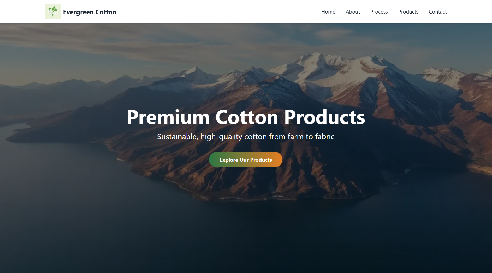

# EverGreenCotton (BlackBoxAI) 

"EverGreenCotton" is a responsive informational website designed to represent a modern cotton factory and its operations. Built with clean HTML, CSS, and JavaScript, the page combines elegant structure and modern styling to offer visitors a clear and engaging overview of the factory's story, products, and processes.

## Live Project :  
https://AICOMp-sketch.github.io/EverGreenCotton/Source%20Code